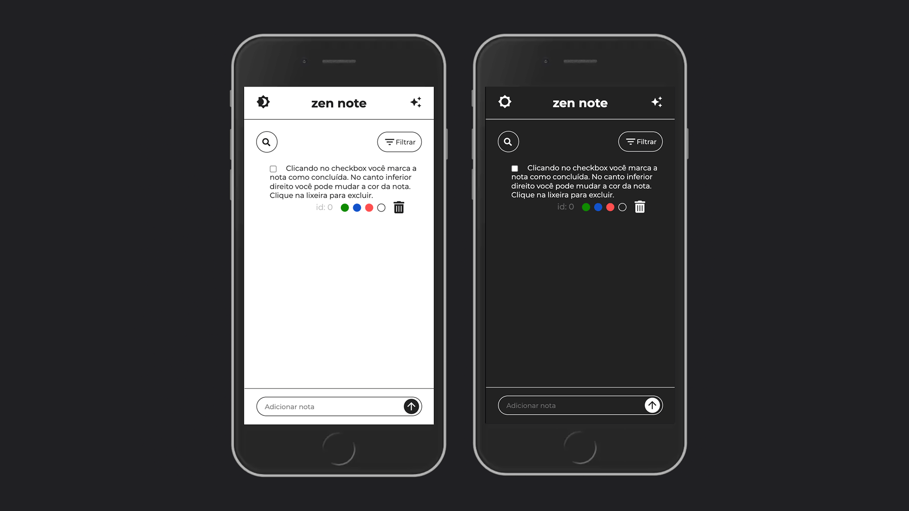

### ☁️ zen note ☁️

Aplicação mobile first responsiva que cria, categoriza e gerencia notas pessoais. Foi utilizado Sass para estilização, manipulação de DOM e métodos nativos javascript.

Contribuições com melhorias e dicas são muito bem vidas. O código é aberto e livre para utilização.

### Demo do Projeto
Link para aplicação: https://zennote.vercel.app/

<hr>

<hr>


### Tecnologias utilizadas
- HTML
- Sass
- Javascript


### 🤝 Para contribuir

- Faça um Fork do Projeto.
- Crie uma branch ```git checkout -b <nome da nova branch>```
- Após fazer sua contribuição no código fonte, adicione as modificações em stage ```git add .```
- Commit as novas implementações ```git commit -m '<descrição do que o commit faz>'```
- Envie as implementações para essa nova branch ```git push origin <nome da nova branch>```
- Volte ao seu repositório github *forkado* e clique em ```compare & pull request```

Ou simplesmente abra uma issue descrevendo suas idéias ou observações.

Sinta-se a vontade para copiar e modificar o que quiser. Manter o conhecimento livre transforma nossa comunidade para melhor, a gente inspira e cria um futuro mais acolhedor.

